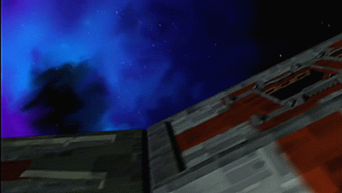

# CobraBay
## A parking guidance system

With a snug two-car garage and two small children, getting parked in exactly the right spot was important. This system
is the product (and ongoing project) of two years work trying to get a good solution to help myself and my wife park in
just the right way.

It has also been the primary way I have taught myself python and electronics, so there is likely a lot that can be 
optimized, done better or redesigned here. Constructive feedback welcome!

---
* [Building](docs/HARDWARE.md) - How to put together the hardware
* Installing - How to install the software
* [Configuration](docs/CONFIG.md) - Reference to the configuration file options.

# Future Enhancements & Bug Fixes
## Enhancements:
* Better separate undock and dock modes. Currently, undock uses too much of the dock behavior.
* Range-based trigger. Start process based on range changes
* Replace strober with progress bar - **In progress**
* Ability to save current system settings to config file
* Ability to soft-reload system from config file
* Ability to save current vehicle position as offsets
* Even better sensor handling. Reset sensors if they go offline. - **In progress**

## Known Issues:
* ~~Detector offsets sometimes don't apply.~~ Fixed (I think)
* If MQTT broker is inaccessible during startup, an MQTT trigger will cause system to go into a loop.

