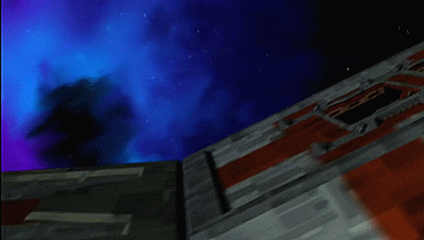

# Cobra Bay
## A parking guidance system

With a snug two-car garage and two small children, getting parked in exactly the right spot was important. This system
is the product (and ongoing project) of two years work trying to get a good solution to help myself and my wife park in
just the right way.

It has also been the primary way I have taught myself python and electronics, so there is likely a lot that can be 
optimized, done better or redesigned here. Constructive feedback welcome!

All versions should be considered Beta, at best!
Current Production version: 0.4.2a6
Current Development version: 0.4.3a1

Changes in 0.4.2a6
* Pull rgbmatrix straight from the rpi-rgb-led-matrix repo, as python packaging PR has been accepted. Still not published to PyPi. See [#1749](https://github.com/hzeller/rpi-rgb-led-matrix/issues/1749) for more info on rpi-rgb-led-matrix Python.
* Rebase library dependencies
  * adafruit-blinka to 8.68.0
  * adafruit-circuitpython-aw9523 to 1.1.14
  * adafruit-circuitpython-vl53l1x to 1.2.7
  * cerberus to 1.3.8
  * numpy to 2.3.5
  * pillow to 12.0.0
  * pint to 0.25.2
  * psutil to 7.1.3
  * pyyaml to 6.0.3

---
* [Building](docs/HARDWARE.md) - How to put together the hardware
* [Installing](docs/INSTALL.md) - How to install the software
* [Configuration](docs/CONFIG.md) - Reference to the configuration file options.

## Bugs
* System
  * Improve I2C Error Handling - Some I2C faults, especially for an AW9523, can still tank the system.
  * Finish implementing threading. Maybe not needed if fault isolation is done? TBD.
  * Fix shutdown exceptions. Sensor destructor doesn't actually work correctly.
  * Report IP correctly on startup
* Logging
  * Add log file size limits and auto-rollover. Otherwise, in debug mode this can fill the filesystem!
* Network
  * MQTT messages go 'unknown' in HA - Should probably be more aggressive about retain statuses.
  * Run network loop after MQTT connect attempt to confirm actual connection.
  * Properly react to homeassistant/status online messages.
* Bay & Sensor
  * Bay doesn't acknowledge range sensor negative range.
  
## Known Issues:
* ~~Detector offsets sometimes don't apply.~~ Fixed (I think)
* If MQTT broker is inaccessible during startup, an MQTT trigger will cause system to go into a loop.

## Enhancements:
* Structure
  * Separate some routines into separate libraries?
  * Write tests
* Performance
  * Split sensors into separate thread/process. 
* Operations
  * MQTT-based sensor
  * Range-based trigger. Start process based on range changes.
  * Additional diagnostics via MQTT. Min/max ranges seen, total faults, total non-numerical values on sensor, maybe more.
  * Restructure commands for cleaner HA interaction.
  * Trigger to end operation, ie when garage door closes.
* Configuration
  * Ability to save current system settings to config file
  * Ability to soft-reload system with new config file.
  * Ability to set some (all?) config values via MQTT.
  * Ability to save current vehicle position as offsets.
* Display
  * Replace strober with progress bar 
  * Micro-car graphic
  * Sensor status graphic
  * Alternatives to clock, possibly divide the display.
* Multiple bay support (is this needed? IDK.)
* Documentation
  * Review install instructions
  * Review current documentation for accuracy
  * Write hardware build guide
  * Create Sphinx documention (also: Learn Sphinx)

